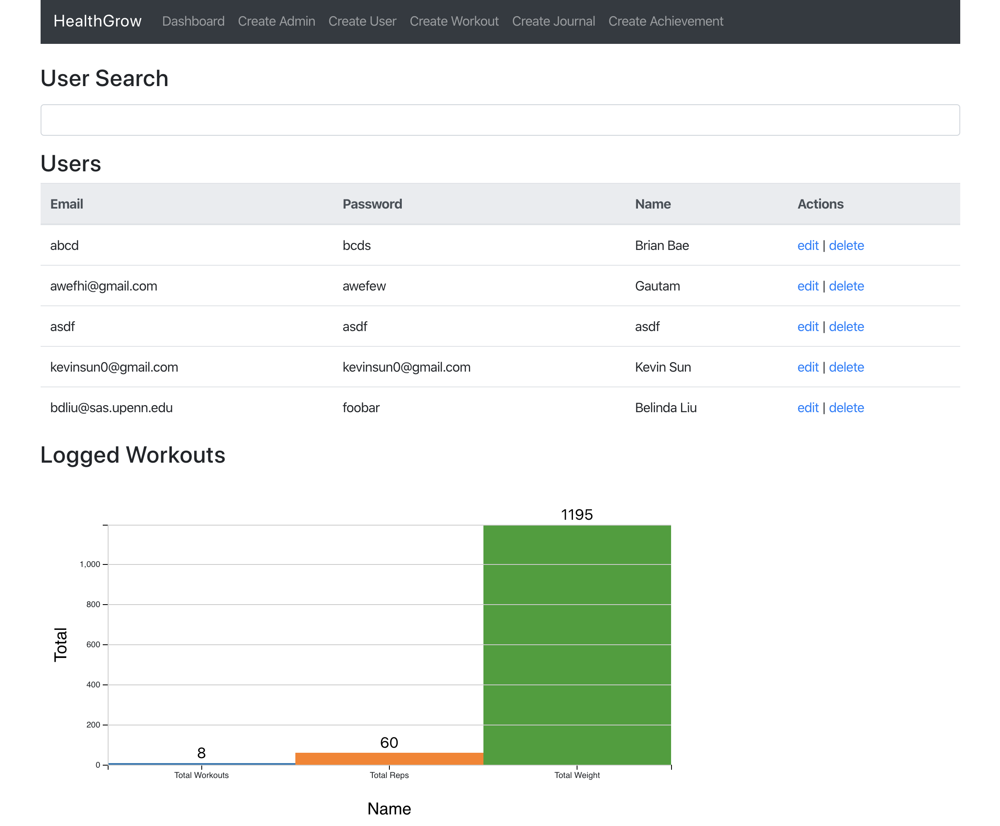

# 350S20-43
Repository for CIS350 Spring'20 group project: HealthGrow. :seedling::chart_with_upwards_trend::rocket::evergreen_tree::palm_tree::cactus::deciduous_tree::blossom::cherry_blossom:

**HealthGrow is currently in early development stage.**

# Getting Started

## Installation
1. Clone the Repo 
2. Run `sudo npm install -g --force nodemon` in `healthgrow-web/backend`
3. Run `npm cache clean --force` in `healthgrow-web`
4. Delete `node_modules` by `rm -rf node_modules package-lock.json` folder or delete it manually by going into the directory and right-click > delete / move to trash. Also, delete `package-lock.json` file too.
5. `npm install`

## Android Setup
1. Open healthgrow-mobile in Android Studio

## Web Setup
1. Start the backend (server) by running `nodemon server` or `node server.js` in `healthgrow-web` or `npm run server` or `npm start` in `healthgrow-web`
2. Start the MERN stack webapp (client) by running `npm run client` in `healthgrow-web`
3. To run the above 2 commands concurrently (in development only) run  `npm run dev`in `healthgrow-web`

## Deployment
1. `heroku git:remote -a frozen-shore-33742`
2. test `heroku local` in `healthgrow-web`
3. `git subtree push --prefix healthgrow-web heroku master`

## Quick Demos

---

Be sure to follow the [contribution guidelines](CONTRIBUTING.md) when submitting code. Always abide by the [code of conduct](CODE_OF_CONDUCT.md).

---
## References
* https://coursework.vschool.io/deploying-mern-with-heroku/

---

## License

- **[MIT license](http://opensource.org/licenses/mit-license.php)**
- Copyright 2015 © <a href="">HealthGrow</a>.